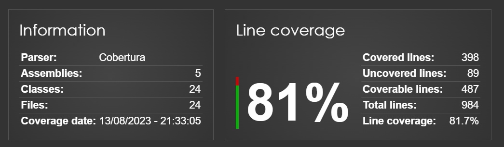

# API WEB DO ASP .NET CORE 6 
## ChallengeBRQ - Usuarios

# 📌 Tópicos

- [Visão geral](#visao-geral)
- [Pré-requisitos](#pre-requisito)
- [Instalação](#instalacao)
- [Exemplar de Usuario](#exemplar)
- [Endpoints](#endpoints)
- [Suporte](#suporte)
- [Histórico de versões](#versoes)

### Visão geral<a name="visao-geral"></a>

O objetivo geral do projeto `.NET API de gerenciamento de usuário` é fornecer um microsserviço confiável e escalável para gerenciar as operações básicas relacionadas a usuários, como criação, atualização, detalhamento, listagem e exclusão de usuários.

### Pré-requisitos<a name="pre-requisito"></a>
- SDK do .NET 6: o SDK (kit de desenvolvimento de software) 
- IDE: você precisará de uma IDE (ambiente de desenvolvimento integrado)
- Gerenciador de pacotes: o .NET 6 usa o gerenciador de pacotes NuGet

### Instalação<a name="instalacao"></a>
- Execute o comando `dotnet restore` para restaurar as dependências do projeto. Isso baixará e instalará todas as bibliotecas e pacotes necessários para a aplicação funcionar corretamente.

Finalmente, execute o comando `dotnet run` para iniciar a aplicação. Isso iniciará o servidor web da aplicação e você poderá acessar a aplicação no seu navegador web em http://localhost..., onde uma nova página no `Swagger` será gerada para identificar os endpoints e necessidades dos dados.

### Exemplar de Usuario<a name="exemplar"></a>
```
{
  "Cpf": "01211149500",
  "email": "ryan@gmail.com",
  "DataDeNascimento": "2002-10-10",
  "sexo": 1,
  "nomeCompleto": "Ryan Pablo Silva Araujo",
  "senha": "ryan@1",
  "apelido": "fazopix",
  "telefone": "77998896712",
  "endereco": {
    "logradouro": "Rua alves",
    "numero": "191",
    "bairro": "ferraz osório",
    "cidade": "ilheus",
    "estado": "ba",
    "pais": "br",
    "cep": "55140000"
  }
}
```



### Endpoints<a name="endpoints"></a>
`POST` - /challengebrq/v1/usuarios                      `Cadastrar Usuários` <br>
`GET` - /challengebrq/v1/usuarios                       `Listar Usuários` <br>
`GET` - /challengebrq/v1/usuarios/{idusuario}           `Detalhar Usuários` <br>
`DELETE` - /challengebrq/v1/usuarios/{idusuario}        `Deletar Usuário` <br>
`PATCH` - /challengebrq/v1/usuarios/{idusuario}         `Atualizar Usuário` <br>
`PUT` - /challengebrq/v1/usuarios/{idusuario}/senhas    `AlterarSenha` <br>
`GET` - /challengebrq/v1/usuarios/{idusuario}/senhas    `Gerar Hash (Esqueceu a senha)` <br>
`POST` - /challengebrq/v1/usuarios/{idusuario}/senhas   `AlterarSenhaViaHash` <br>

### Suporte<a name="suporte"></a>
[Linkedin](https://www.linkedin.com/in/ryanpsa/)

### Histórico de versões<a name="versoes"></a>
- Versão 1 - [Em andamento]
